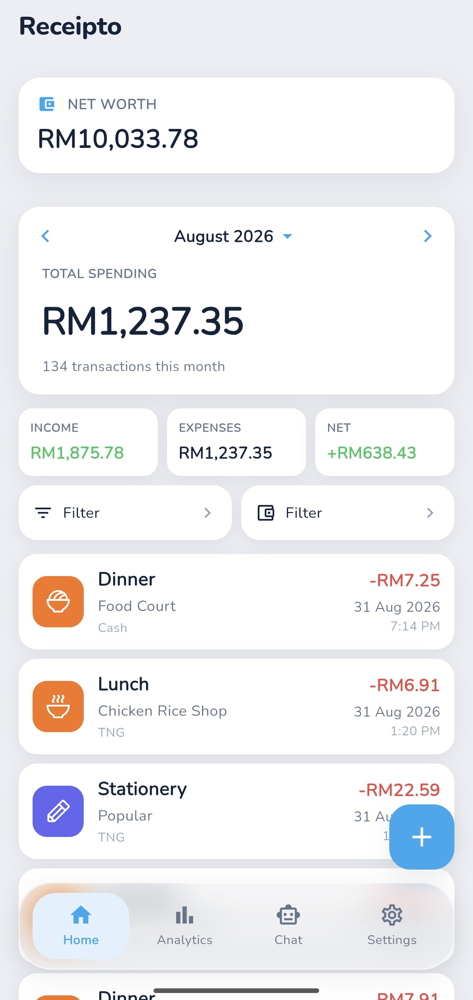
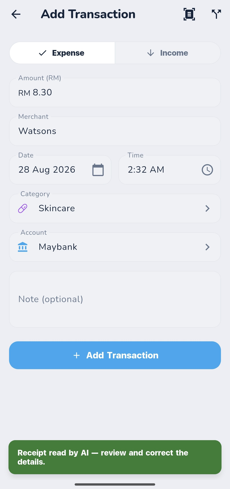
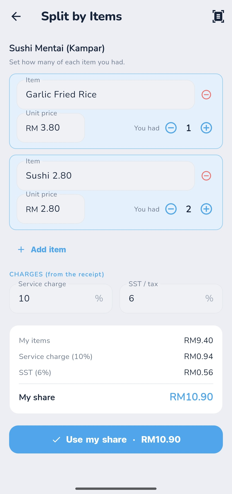
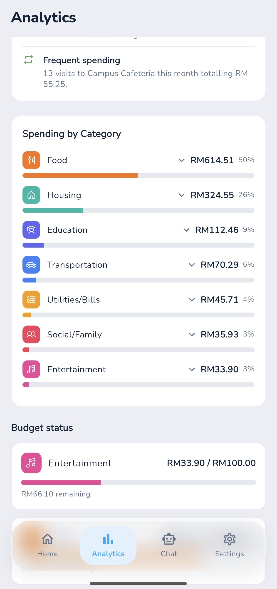
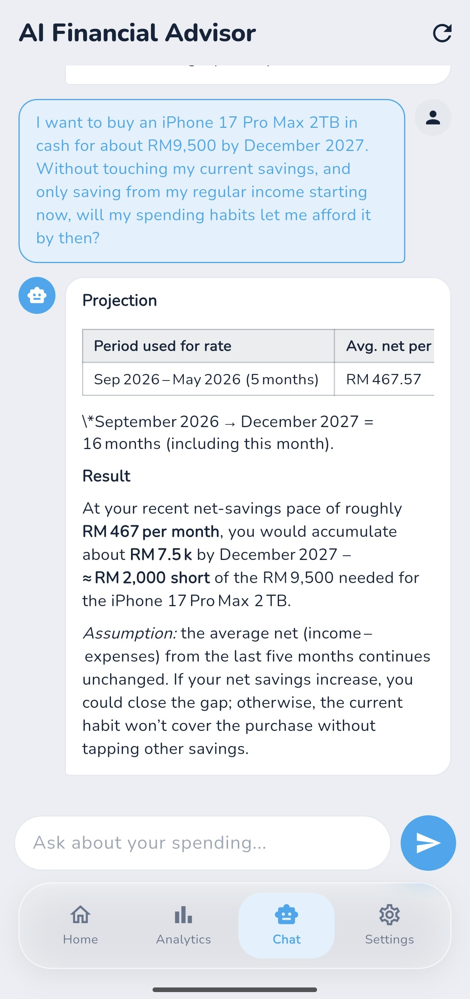
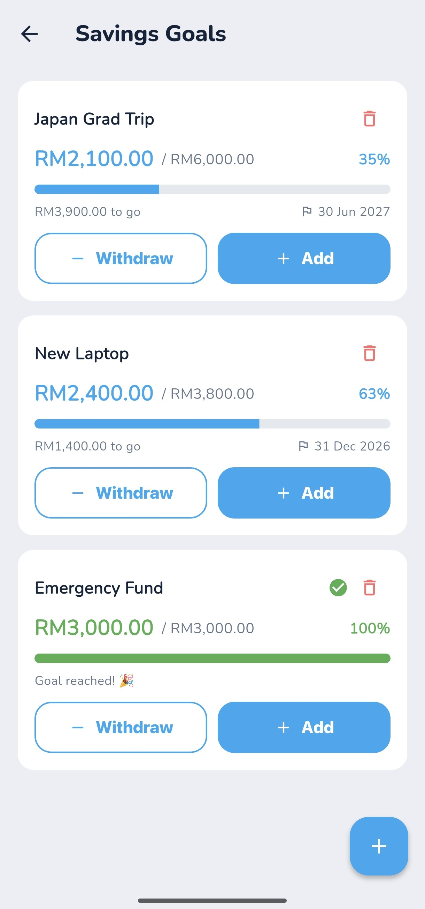
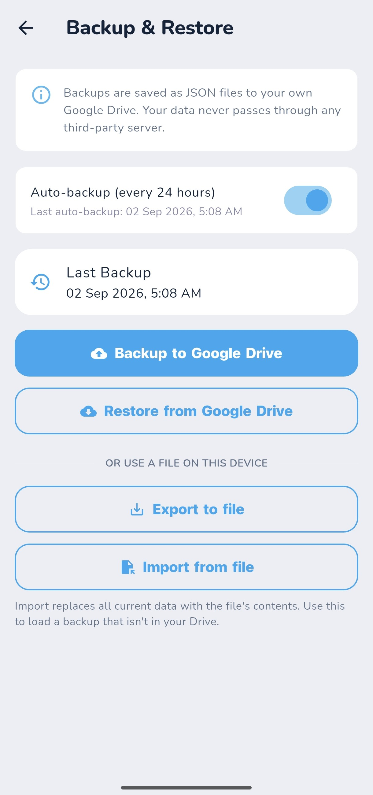

<div align="center">
  

  # Receipto

  **Intelligent Personal Finance Management System**

  A Final Year Project · Bachelor of Computer Science (Honours) 

  
  
  -4E7FE1)
  -6F5EE0)
  [](LICENSE)
</div>

<br>

Receipto is a Flutter/Android personal finance app for students and young
adults: record transactions, scan receipts with AI, split shared bills,
track budgets and savings goals, and ask a chatbot about your own spending.
Every feature runs entirely on the device. There is no backend server, no
account to sign into, and no data ever leaves your phone except the two
calls you explicitly opt into: your chosen AI provider (Groq, bring your
own key) and, if you turn it on, Google Drive for backup.

## Screenshots

<table>
  <tr>
    <td align="center" width="33%"><br><sub>Home</sub></td>
    <td align="center" width="33%"><br><sub>Scan Receipt</sub></td>
    <td align="center" width="33%"><br><sub>Split Bill</sub></td>
  </tr>
  <tr>
    <td align="center"><br><sub>Analytics</sub></td>
    <td align="center"><br><sub>AI Financial Advisor</sub></td>
    <td align="center"><br><sub>Savings Goals</sub></td>
  </tr>
  <tr>
    <td align="center" colspan="3"><br><sub>Backup &amp; Restore</sub></td>
  </tr>
</table>

## Features

### Core finance management
- **Transactions** — add, edit, and delete, with category + subcategory,
  account/payment method, date, notes, and a marker for entries created via
  receipt scanning.
- **Categories** — 11 preset categories with 45 subcategories, each with its
  own icon and a user-selectable colour, fully editable and extendable.
- **Budgets** — per-category monthly limits, with spending automatically
  rolled up from subcategories into their parent category.
- **Savings goals** — a target amount, a saved amount, an optional target
  date, and contributions that can be logged independently of any single
  transaction.
- **Recurring transactions** — weekly or monthly templates (rent,
  subscriptions, bills) that materialise into real transactions on their own
  once due.
- **Wallets & accounts** — multiple accounts (bank, cash, e-wallet, other),
  transfers between them, and a live net-worth figure computed from actual
  activity rather than a manually maintained balance.
- **Bill splitting** — scan a shared receipt or add items by hand, mark how
  many of each item were yours, and the app applies the printed service
  charge and SST to compute your share.
- **Analytics** — monthly income/expense/net, a category breakdown with a
  subcategory drill-down, a 6-month trend chart, and rule-based Smart
  Insights (budget overruns, category spikes, unusually large transactions,
  possible duplicate charges, frequent merchants).
- **Backup & restore** — full JSON export/import, either to a local file
  (fully offline) or to your own Google Drive, with an optional silent
  auto-backup every 24 hours.

### AI (Groq, bring your own key)
- **Receipt scanning** — a Groq vision model reads a photo of a receipt or
  payment screenshot and extracts the merchant, date, total, and a suggested
  category, with a keyword-based fallback when no key is configured.
- **AI Financial Advisor** — ask natural-language questions about your own
  spending. The system classifies the question, injects only the relevant
  summarised data from your local history, and can reason about
  affordability and savings projections, not just answer simple lookups.
- One provider, two jobs: the same Groq endpoint powers both the vision call
  and the chat model, so there is nothing else to configure beyond a single
  API key.

## Tech stack

| Layer | Choice |
|---|---|
| Framework | Flutter (Dart) |
| State management | Provider |
| Persistence | SQLite (`sqflite`), no backend server |
| AI (BYOK) | Groq — vision (receipt scanning) and chat (AI advisor) |
| Cloud backup (optional) | Google Drive API |
| Local backup (optional) | Local file export/import (JSON) |
| Secure storage | `flutter_secure_storage` |

## Getting started

```bash
flutter pub get
flutter run
```

Requires Flutter (Dart SDK `^3.8.1`) and an Android device or emulator
(`minSdk 23`). No `.env` or backend setup is needed. AI features are opt-in
via **Settings → Manage API Keys**, where you add your own Groq key (free,
no card required). Google Drive backup is likewise opt-in via
**Settings → Backup & Restore**; the local file export/import path next to
it needs no account at all.

### Building

```bash
flutter build apk --release
```

### Regenerating the app icon

```bash
dart run flutter_launcher_icons
```

Regenerates the Android launcher icons from `assets/icon/app_icon.png`.

### Tests

```bash
flutter test
```

## Project structure

```
lib/
  constants/   Theme, category icon/colour presets, app-wide constants
  models/      Transaction, Account, Goal, RecurringTransaction, CategoryModel
  providers/   ChangeNotifier state: transactions, accounts, categories,
               budgets, goals, recurring, settings
  screens/     Home, Analytics, AI Advisor (chat), Settings, Add/Edit
               Transaction, Split Bill, Manage Categories, Budgets,
               Savings Goals, Recurring, Wallets, Backup & Restore
  services/    SQLite database helper, Groq AI service, Google Drive
               backup, rule-based Smart Insights, secure storage
  widgets/     Shared UI: pickers, tiles, glass/pressable/route components
assets/icons/  SVG glyphs for the 11 categories and 45 subcategories
assets/icon/   Source image for the app launcher icon
```

## License

This project is licensed under the [MIT License](LICENSE).

---

